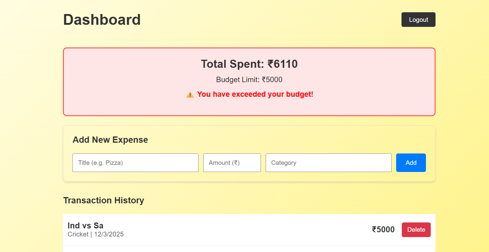

# 💰 Budget Control System (MERN Stack)


> A full-stack financial tracking application designed to help users monitor expenses, set budget limits, and maintain financial discipline through a secure and intuitive interface.

---

## 📸 Application Previews

### The Dashboard
Real-time expense tracking with dynamic budget alerts.


### Secure Authentication
Professional login/signup with JWT security and form validation.


---

## 🚀 Key Features

### 🔐 Advanced Security
* **JWT Authentication:** Stateless authentication using JSON Web Tokens.
* **Password Encryption:** User passwords are hashed using `bcryptjs` before storage; raw passwords are never saved.
* **Protected Routes:** Backend middleware ensures only authenticated users can access or modify data.

### 💸 Smart Expense Management
* **Real-Time Calculations:** The dashboard automatically calculates total expenditure.
* **Budget Logic:** Visual indicators change from **Green (Safe)** to **Red (Danger)** when the user exceeds their defined budget limit (e.g., ₹5000).
* **CRUD Operations:** Users can Create, Read, and Delete expenses instantly.
* **Data Persistence:** All transactions are stored permanently in MongoDB Atlas.

### 🎨 Modern UI/UX
* **Responsive Design:** Works on desktop and mobile.
* **Professional Styling:** Features a custom "Golden Gradient" theme (`#fffde7` to `#fff176`) for a premium financial app feel.
* **Instant Feedback:** React state management provides immediate UI updates without page reloads.

---

## 🛠️ Tech Stack & Tools

| Component | Technology | Description |
| :--- | :--- | :--- |
| **Frontend** | React.js | Functional Components, Hooks (`useState`, `useEffect`, `useContext`) |
| **Routing** | React Router v6 | Client-side navigation |
| **HTTP Client** | Axios | Handling API requests and Headers |
| **Backend** | Node.js & Express | RESTful API architecture |
| **Database** | MongoDB & Mongoose | NoSQL Schema-based data modeling |
| **Auth** | JWT & Bcrypt | Security and Encryption |

---

## ⚙️ Local Installation Guide

Follow these steps to set up the project locally on your machine.

### Prerequisites
* Node.js installed
* MongoDB Atlas Account (or local MongoDB)

### Clone the Repository
```bash
git clone [https://github.com/YOUR_USERNAME/budget-control-system.git](https://github.com/YOUR_USERNAME/budget-control-system.git)
cd budget-control-system
```
Backend Setup
```Bash

cd server
npm install
```
Create a .env file in the server folder with the following:

Code snippet

MONGO_URI=your_mongodb_connection_string
JWT_SECRET=your_secret_key_here
PORT=5000
Start the server:

Bash
```
npm run dev
```
Frontend Setup
Open a new terminal and navigate to the client folder:

Bash
```
cd ../client
npm install
npm start
```
The application will launch automatically at http://localhost:3000.

